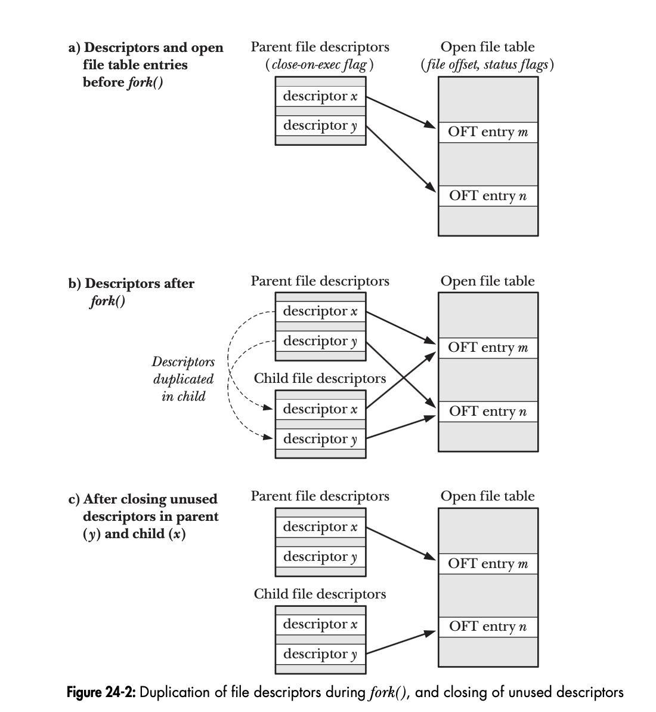
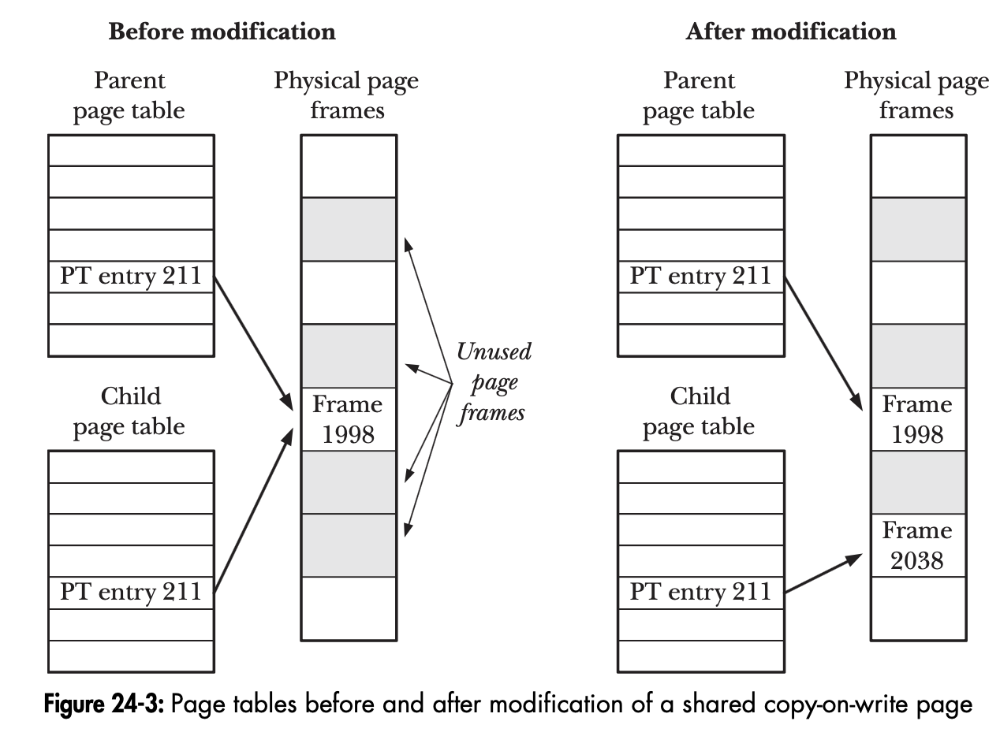

# 24 Process Creation

You are absolutely right. The book treats these four system calls as the "Life Cycle of a Process." To understand one, you must understand how they all interact.

---

## 24.1: Overview of fork(), exit(), wait(), and execve()

### 1. Theory: The Circle of Life

In the Linux world, process management follows a very specific lifecycle:

1. **`fork()` (Birth):** A parent process creates a child. The child is a **clone**.
2. **`exit()` (Death):** The process finishes its work and tells the Kernel: "I'm done. Here is my status code (e.g., 0 for success)."
3. **`wait()` (Funeral):** The parent asks the Kernel: "Has my child finished yet?" If the child is dead, `wait()` allows the parent to collect the exit status. If the parent doesn't `wait()`, the dead child becomes a **Zombie**.
4. **`execve()` (Reincarnation):** This is how a process changes its identity. It wipes out its current memory and loads a **new program** (like `ls` or `grep`) into its existing PID.

---

### 2. Lab Set: The "Birth, Change, and Death" Sequence

We will write a script that uses all four concepts. The Parent will fork, the Child will change into a different program, and the Parent will wait for the result.

**Step 1: Create `lifecycle_demo.py**`

```python
import os
import sys
import time

print(f"PARENT: Starting. My PID is {os.getpid()}")

pid = os.fork()

if pid == 0:
    # --- THE CHILD ---
    print(f"CHILD: I am born. My PID is {os.getpid()}")
    print("CHILD: I am about to change into the 'ls' program using exec...")
    
    # execve replaces the current process. 
    # Arguments: (path, [args], environment)
    os.execv("/bin/ls", ["ls", "-l", "/etc/hostname"])
    
    # This line will NEVER print because execv wiped out this python script!
    print("CHILD: You will never see this.")

else:
    # --- THE PARENT ---
    print(f"PARENT: I am waiting for my child (PID {pid}) to finish.")
    
    # wait() returns a tuple: (pid, exit_status)
    child_pid, status = os.wait()
    
    # The status is a bit-field; we use os.WEXITSTATUS to get the actual exit code
    exit_code = os.WEXITSTATUS(status)
    print(f"PARENT: Child {child_pid} died with exit code {exit_code}")

```

**Step 2: Execute and Observe**

1. Run `python3 lifecycle_demo.py`.
2. Notice that the `ls -l` output appears in the middle of your Python script's output.
3. **SRE Task:** Change the `os.execv` path to something that doesn't exist (like `/bin/nonexistent`) and see how the parent catches the failure exit code.

---

### 3. Interview Scenarios & SRE Perspectives

#### Scenario A: The Zombie Apocalypse

**Interviewer:** *"I see a lot of processes in `top` marked as `<defunct>` or `Z`. What does this mean, and how do I fix it?"*

**The SRE Answer:**

> "A **Zombie process** is a process that has called `exit()` but its parent has not yet called `wait()`. The Kernel keeps the zombie in the process table so the parent can eventually read its exit status.
> You cannot `kill -9` a zombie because it is already dead. To fix it, you must either fix the parent process so it calls `wait()`, or kill the **Parent**. When the parent dies, the zombie is 're-parented' to PID 1 (init), which automatically calls `wait()` to clean up all its orphans."

#### Scenario B: `execve` and File Descriptors

**Interviewer:** *"If I open a log file in my Python script and then call `execve()` to run a Bash script, can the Bash script write to that same log file?"*

**The SRE Answer:**

> "Yes, by default. `execve` replaces the memory (the code and variables), but it **preserves the File Descriptor table**. The Bash script can simply write to the same FD number (like 3 or 4) that was open in the Python script.
> As an SRE, if I want to prevent this for security, I should set the **`FD_CLOEXEC`** (Close-on-Exec) flag on the file descriptor before calling `execve`."

#### Scenario C: Why `fork()` then `execve()`?

**Interviewer:** *"Why doesn't Linux just have a single `run_new_program()` command? Why do we have to `fork()` first and then `execve()`?"*

**The SRE Answer:**

> "Separating them gives the programmer a chance to **configure the environment** for the child. Between `fork()` and `execve()`, the child is still running the original code. In that 'middle ground,' the child can change its User ID, change its working directory, redirect its `stdout` to a log file, or set resource limits. This flexibility is what allows Shells to do things like `ls > output.txt`."

---

### Your Next Step

Try to run `lifecycle_demo.py` again, but this time, **comment out** the `os.wait()` line in the parent section.

1. Run the script.
2. While the parent is sleeping, run `ps -ef | grep defunct` in another terminal.
3. **Do you see the Zombie?**

**Would you like to move to 24.2: File Descriptors across `fork()` to see the specific details of how FDs are shared?**

Let's break these down. These two scenarios are the "bread and butter" of SRE work because they explain how processes talk to the outside world and how we secure them.

---

### Scenario B: File Descriptors across `execve()`

**The "Reincarnation" Rule**

Imagine you have a Python script. You open a file called `debug.log`. The Kernel gives you **File Descriptor 3**.

Now, your Python script calls `execve()` to transform into a Bash script.

* **The Memory:** Everything about Python (variables, code, loops) is **deleted**.
* **The Process ID:** Stays the **same**.
* **The File Descriptors:** They **survive**.

**Why is this a Troubleshooting Scenario?**
Imagine you are an SRE investigating a security leak. A high-privileged process opens a sensitive `/etc/shadow` file, then "reincarnates" (execs) into a low-privileged user script. If the programmer forgot to close that file, the low-privileged script **still has File Descriptor 3 open** and can read the secrets!

**The SRE Fix:** We use the `FD_CLOEXEC` flag. It tells the Kernel: *"If this process ever calls `execve()`, close this file automatically during the transition."*

---

### Scenario C: Why `fork()` then `execve()`?

**The "Middle Ground" Strategy**

If Linux had a single command like `StartNewProgram("/bin/ls")`, it would be too rigid. By splitting it into two steps, Linux gives the Child process a "moment of reflection" before it changes its identity.

**The "Moment of Reflection" (The Gap):**

1. **`fork()` happens:** Now you have a Child. It is a clone of the Parent.
2. **THE GAP:** The Child is still running the Parent's code, but it knows it's the Child. In this gap, the Child can:
* Change its priority (`nice`).
* Redirect its output (Close FD 1, Open `output.txt`).
* Drop privileges (Switch from `root` to `nobody`).


3. **`execve()` happens:** The identity change is final.

**SRE Example:** This is exactly how a Shell handles redirection. When you type `ls > files.txt`:

* The Shell **forks**.
* In the **Gap**, the Child closes its "Screen" output and opens `files.txt`.
* Then the Child calls **`execve("ls")`**.
* The `ls` program has no idea it's writing to a file; it just thinks it's writing to its standard output (FD 1).

---

## 24.2: File Descriptors across `fork()`

### 1. Theory: Shared Offsets and Open Files

This is one of the most technical parts of the book. When you `fork()`, the Child doesn't just get its own copy of the File Descriptors—it **shares** the "Open File Description" with the Parent.

* **The Pointer:** If the Parent has read 100 bytes of a file and then forks, the Child starts reading at byte 101.
* **Shared Offset:** If the Child moves the file pointer (using `lseek`), the Parent's pointer **also moves**. They are linked.
* **Reference Count:** The file won't truly close until **both** the Parent and Child close their respective File Descriptors.

---

### 2. Lab Set: The Shared Pointer Experiment

Let's prove that the Parent and Child share the same "place" in a file.

**Step 1: Create a dummy file**

```bash
echo "ABCDEFGHIJKLMNOPQRSTUVWXYZ" > alphabet.txt

```

**Step 2: Create `shared_fd.py**`

```python
import os

# Parent opens the file
fd = os.open("alphabet.txt", os.O_RDONLY)

# Parent reads 5 bytes
print(f"Parent read: {os.read(fd, 5).decode()}") # Should be ABCDE

pid = os.fork()

if pid == 0:
    # CHILD
    # Because they share the offset, the child starts at byte 6
    print(f"Child read: {os.read(fd, 5).decode()}") # Should be FGHIJ
    os.close(fd)
else:
    # PARENT
    os.wait() # Wait for child to finish reading
    # If they share the offset, the parent now picks up after the child!
    print(f"Parent read again: {os.read(fd, 5).decode()}") # Should be KLMNO
    os.close(fd)

```

**Step 3: Run it**
`python3 shared_fd.py`
You will see that the file pointer moves forward continuously, even though two different processes are calling `read()`.

---

### 3. Interview Scenarios & SRE Perspectives

#### Scenario A: The "Leaked" Socket

**Interviewer:** *"A web server forks a child to handle a request. The child finishes and exits, but the client connection is still open and 'hung.' Why?"*

**The SRE Answer:**

> "This usually happens because the Parent process forgot to close its copy of the socket. Even though the Child exited (closing its FD), the Kernel sees that the Parent still has a reference to that Open File Description. The connection stays 'ESTABLISHED' until every process that inherited that FD closes it. As an SRE, I'd check `lsof -p [Parent_PID]` to see if it's holding onto FDs it should have handed off."

#### Scenario B: The Log File Race Condition

**Interviewer:** *"If a Parent and Child both write to the same log file at the exact same time after a fork, will they overwrite each other's text?"*

**The SRE Answer:**

> "Actually, no, provided the file was opened with the **`O_APPEND`** flag. Because they share the same 'Open File Description' and file offset, the Kernel ensures that each write happens at the current end-of-file. However, if they used `lseek` or standard `write` without `O_APPEND`, they could absolutely overwrite each other because they are fighting over the same shared offset pointer."

---

**Would you like to move to 24.3: Memory layout after `fork()`, where we explain the "Copy-on-Write" logic in much deeper detail?**

---

**Next Step for you:** Try running the `shared_fd.py` lab. Does the output match the "ABCDE...FGHIJ...KLMNO" sequence?

To truly understand **Scenario B (The Log File Race Condition)**, you need to see how the Kernel manages a shared file offset.

We will create a lab where a Parent and a Child "race" to write to the same file. We will test two conditions:

1. **Normal Write:** Where they might overwrite each other if not careful.
2. **O_APPEND Write:** Where the Kernel protects the order.

---

### 🛠 Lab Set: The "Shared Offset" Race

**Step 1: Create the script `race_condition.py**`

```python
import os
import time

# We open the file in standard Write mode (not append)
fd = os.open("race_results.txt", os.O_RDWR | os.O_CREAT | os.O_TRUNC, 0o644)

pid = os.fork()

if pid == 0:
    # --- CHILD ---
    # The child waits a split second to let parent start
    time.sleep(0.01)
    os.write(fd, b"CHILD_WAS_HERE---")
    os.close(fd)
else:
    # --- PARENT ---
    os.write(fd, b"PARENT_DATA_START")
    # We wait for child to finish its write
    time.sleep(1)
    os.write(fd, b"PARENT_DATA_END")
    
    os.wait()
    os.close(fd)
    
    # Read back the results
    with open("race_results.txt", "r") as f:
        print(f"Final File Content: {f.read()}")

```

**Step 2: Run and Analyze**

1. Run `python3 race_condition.py`.
2. **The Result:** You will see: `PARENT_DATA_STARTCHILD_WAS_HERE---PARENT_DATA_END`.
3. **The SRE Logic:** Notice how the child's data is injected *between* the parent's data. This proves they **share the same offset**. When the parent wrote the first part, the offset moved to position 17. When the child wrote, it started at 17 and moved it to 34. When the parent woke up, it started at 34.

---

### 3. Interview Scenarios & SRE Perspectives (Revisited)

#### Scenario B (Extended): The "O_APPEND" Solution

**Interviewer:** *"If you have 100 child processes all logging to the same file, how do you prevent them from corrupting each other's log lines?"*

**The SRE Answer:**

> "In the lab above, if the child had used `lseek(fd, 0, SEEK_SET)` to go back to the start, it would have overwritten the parent's data. To prevent this in production, we open log files with the **`O_APPEND`** flag.
> When `O_APPEND` is set, the Kernel guarantees that every `write()` call automatically moves the file offset to the **actual end of the file** as an atomic operation. Even if 100 processes write at the same millisecond, the Kernel queues them so that no data is overwritten."

---

## 24.3: Memory Layout after `fork()` (Copy-on-Write)

### 1. Theory: The Efficient Clone

In the old days of Unix, `fork()` was slow because it literally copied every byte of RAM from parent to child. Modern Linux uses **Copy-on-Write (COW)**.

* **The Concept:** Initially, the Child's virtual memory points to the **exact same physical RAM pages** as the Parent.
* **Read-Only Status:** The Kernel marks these shared pages as "Read-Only."
* **The "Write" Trigger:** If either the Parent or Child tries to change a variable (write to memory):
1. The CPU triggers a **Page Fault**.
2. The Kernel notices this is a COW page.
3. The Kernel **copies** that specific 4KB page to a new physical location.
4. The process that tried to write now has its own private copy.


---

### 2. Lab Set: Measuring the "Memory Illusion"

We will use the `/proc/self/smaps` file to see how memory is shared.

**Step 1: Create `cow_test.py**`

```python
import os
import time

# Create a large list (roughly 100MB of data)
data = ["X" * 1024 for _ in range(100000)]
print("Parent created 100MB of data.")

pid = os.fork()

if pid == 0:
    # CHILD
    print("Child born. Check memory now (it should be shared).")
    time.sleep(10) # Look at RSS in 'top' now
    
    print("Child is modifying memory...")
    # Modifying the data forces a 'Copy'
    for i in range(len(data)):
        data[i] = "Y" * 1024
    
    print("Child modified memory. Check memory again (it should be private).")
    time.sleep(10)
else:
    # PARENT
    os.wait()

```

**Step 2: The SRE Observation**

1. Run the script.
2. While the child is in the first `sleep`, run `top -p [PID_OF_CHILD]`. Look at **RES** (Resident Memory).
3. Wait for the "Child is modifying" message.
4. Watch the **RES** column in `top`. It will suddenly spike!
5. **Why?** Because the "Illusion" of shared memory ended the moment the child tried to change the "X"s to "Y"s.

---

### 3. Interview Scenarios & SRE Perspectives

#### Scenario A: The Redis "BGSAVE" Trick

**Interviewer:** *"Redis is a single-threaded database. How does it manage to save a 50GB database to disk without stopping the service (blocking the main thread)?"*

**The SRE Answer:**

> "Redis uses `fork()`. When it needs to save, it forks a child process. Because of **Copy-on-Write**, the fork is nearly instant. The child has a 'snapshot' of the 50GB database in its virtual memory. The child then writes that memory to disk. Meanwhile, the Parent continues to serve clients. If a client updates a key, the Kernel just copies that specific 4KB page for the parent. This allows Redis to perform 'Point-in-time' snapshots with very little memory overhead."

---

**Would you like to move to 24.4: The `vfork()` system call (The faster, more dangerous sibling of fork)?**

**Next Step:** I can explain why `vfork()` was invented and why modern SREs usually tell developers to avoid it. Would you like that?

Since we’ve covered the overview of the "Life Cycle," let's zoom in specifically on **24.2: File Descriptors across `fork()**`. This is the subtopic that most often causes production "leaks" that SREs have to debug.

---

## 24.2: File Descriptors across `fork()`

### 1. The Theory: Shared "Open File Descriptions"

When you `fork()`, the child gets a duplicate of the parent's **File Descriptor (FD) Table**. However, there is a catch that catches many developers off guard:

* **The Duplicate:** The FD numbers (0, 1, 2, 3...) are copied.
* **The Shared Reality:** The actual "Open File Description" (the kernel's internal record of the file, the position/offset, and the status flags) is **shared**.
* **The Shared Offset:** If the parent reads 10 bytes, the "file pointer" moves forward for the child too. If the child closes the file, the parent still has it open (because the "reference count" only dropped by 1), but they are both looking at the same "cursor" in the file.

---

### 2. Lab Set: The "Shared Pointer" Mystery

Let's prove that the Parent and Child are "fighting" over the same cursor in a file.

**Step 1: Create a test file**

```bash
echo "1234567890abcdefghij" > test_file.txt

```

**Step 2: Create the Python script `fd_share.py**`

```python
import os
import time

# Parent opens the file and reads 5 bytes
fd = os.open("test_file.txt", os.O_RDONLY)
print(f"PARENT (PID {os.getpid()}): Read: {os.read(fd, 5).decode()}") # Reads 12345

pid = os.fork()

if pid == 0:
    # --- CHILD ---
    # Because the offset is shared, the child starts at byte 6!
    print(f"CHILD  (PID {os.getpid()}): Read: {os.read(fd, 5).decode()}") # Reads 67890
    os.close(fd)
else:
    # --- PARENT ---
    time.sleep(1) # Wait for child to finish reading
    # The child moved the pointer! Parent now reads from byte 11
    print(f"PARENT (PID {os.getpid()}): Read again: {os.read(fd, 5).decode()}") # Reads abcde
    os.close(fd)

```

**Step 3: Run and Observe**

1. Run `python3 fd_share.py`.
2. Notice the output is seamless: `12345` -> `67890` -> `abcde`. This proves they share a single "cursor" in the file.

---

### 3. Interview Scenarios & SRE Perspectives

#### Scenario A: The "Hanging" Network Connection

**Interviewer:** *"We have a web server that forks a worker to handle a long download. The worker finishes and exits, but the client's TCP connection remains 'ESTABLISHED' and never closes. Why?"*

**The SRE Answer:**

> "This is a classic FD leak. When the parent `fork()`ed, the network socket FD was copied to the child. Even though the child finished and its FD was closed by the OS, the **Parent still has a copy of that FD open**. The Kernel will not close the TCP connection until the reference count reaches zero. The SRE fix is to ensure the parent closes its copy of the socket immediately after the `fork()` if the child is the one handling the communication."

#### Scenario B: The "Atomic" Logging Requirement

**Interviewer:** *"If two processes are writing to the same log file after a fork, how do you prevent them from overwriting each other's lines?"*

**The SRE Answer:**

> "You must use the **`O_APPEND`** flag when opening the file. Without it, if Process A calculates the file offset, gets interrupted, and Process B writes data, Process A might write over Process B's data when it resumes. With `O_APPEND`, the Kernel guarantees that the 'seek-to-end' and 'write' happen as a single **atomic** action. This ensures every log line is appended to the very end, regardless of how many children are writing."

---

kv

### 🛠 Your Next Lab Challenge:

Try to modify `fd_share.py` so that the Child uses `os.lseek(fd, 0, os.SEEK_SET)` (which moves the pointer back to the start) before it reads.

* **Question:** Will the Parent's final read be affected?
* **Result:** It will! Because they share the offset, the Child's `lseek` will pull the Parent's "cursor" back to the start of the file too.

**Ready to move to 24.3: Memory Layout and Copy-on-Write (COW)? This explains why `fork()` is so fast even for huge processes.**

---

**Next Step for you:** Would you like to see a lab where we measure exactly how much "Real RAM" is used during a `fork()` of a 1GB process?

This is the "magic" section. This explains why a Linux server doesn't immediately explode when a giant database process decides to fork.

---

## 24.2.2: Memory Semantics of fork() (Copy-on-Write)

### 1. The Theory: The "Lazy" Clone

In early Unix, `fork()` was slow because it physically copied every byte of the parent’s memory into the child. If the parent used 1GB, the system needed another 1GB immediately.

Modern Linux uses **Copy-on-Write (COW)** to be efficient:

* **Initial State:** When `fork()` is called, the Kernel does **not** copy the memory. Instead, it creates a new Page Table for the child that points to the **exact same physical RAM pages** as the parent.
* **The "Read-Only" Trick:** The Kernel marks all these shared pages as **Read-Only** in both processes.
* **The Violation:** As long as both processes are just *reading* data, they share the same physical RAM.
* **The Copy:** The moment either process tries to *modify* (write to) a page:
1. The CPU triggers a **Page Fault** because the page is marked Read-Only.
2. The Kernel realizes this is a COW page.
3. The Kernel allocates a **new physical page**, copies the 4KB of data into it, and updates that process's Page Table to point to the new private copy.
4. The page is now marked **Read-Write**.



---

### 2. Lab Set: Proving the Memory Illusion

We will use `/proc/self/statm` to monitor "Resident Set Size" (RSS), which is the actual physical RAM being used.

**Step 1: Create `cow_lab.py**`

```python
import os
import time

# 1. Parent allocates a large chunk of memory (~100MB)
print("Parent: Allocating 100MB...")
big_data = bytearray(100 * 1024 * 1024)

print(f"Parent PID: {os.getpid()}")
input("Press Enter to fork...")

pid = os.fork()

if pid == 0:
    # --- CHILD ---
    child_pid = os.getpid()
    print(f"\n[CHILD] PID: {child_pid}")
    print("[CHILD] I have the 100MB array, but I haven't 'touched' it yet.")
    time.sleep(15)
    
    print("\n[CHILD] Now writing to the array (Triggering COW)...")
    # We modify the array to force the Kernel to make private copies
    for i in range(len(big_data)):
        big_data[i] = 1 
        
    print("[CHILD] Memory modified. Check 'top' again.")
    time.sleep(15)
else:
    # --- PARENT ---
    os.wait()

```

**Step 2: Execution & Observation**

1. Run the script in **Terminal 1**.
2. In **Terminal 2**, run `top -p [CHILD_PID]`.
3. **Observation 1:** Right after the fork, the Child's `RES` (Resident) memory will be very low (usually < 10MB), even though it "has" 100MB of data. It is sharing with the parent.
4. **Observation 2:** Once the child starts writing, you will see `RES` jump to **100MB** in `top`.

---

### 3. Interview Scenarios & SRE Perspectives

#### Scenario A: The "Sudden" OOM (Out of Memory)

**Interviewer:** *"I have a 16GB RAM server. I am running a 10GB Redis instance. I trigger a background save (which forks). The fork is successful, but 2 minutes later, the Kernel kills the process. Why didn't it fail during the fork?"*

**The SRE Answer:**

> "This is the 'COW Trap.' The `fork()` succeeded because initially, it cost almost zero RAM. However, as Redis continued to handle new write requests, the **Parent** started modifying its memory pages. This forced the Kernel to create new copies of those pages for the parent. Since the server only had 6GB of free RAM left, but the writes eventually touched more than 6GB worth of pages, the system ran out of physical memory and triggered the OOM Killer."

#### Scenario B: `fork()` vs `vfork()`

**Interviewer:** *"If COW is so efficient, why does `vfork()` still exist?"*

**The SRE Answer:**

> "Even though COW is fast, it still requires the Kernel to duplicate the **Page Tables**. For a process with a massive memory footprint (like a multi-terabyte database), duplicating the Page Tables themselves can take hundreds of milliseconds. `vfork()` avoids even this by having the child 'borrow' the parent's Page Tables entirely until it calls `exec()`. However, `vfork()` is dangerous and mostly replaced by `posix_spawn()` in modern SRE practices."

#### Scenario C: Optimizing Microservices

**Interviewer:** *"How can we use COW to make our Python/Ruby containers start faster and use less RAM?"*

**The SRE Answer:**

> "We use **Pre-loading**. If we load all our heavy libraries (like Pandas or TensorFlow) in the **Parent** process *before* forking the worker processes (like Gunicorn or UWSGI do), all workers will share the same physical RAM for those libraries. This reduces the total RAM footprint and speeds up worker startup."

---

**Would you like to move to 24.3: The `vfork()` system call, or shall we skip to the "Death" of a process in 25.1: Process Termination?**

**Next Step:** I can explain why a "Dirty" exit (using `_exit()`) is actually safer than a "Clean" exit (`exit()`) when you are inside a Child process. Would you like to see that?

This is a perfect way to wrap up the "Process Creation" section. Understanding the efficiency trade-offs between these three is what separates a junior admin from a **Senior Systems Engineer**.

Here is the summary of how these mechanisms interact, their efficiency, and the modern standard.

---

### 1. The Summary Table: `fork()` vs `vfork()` vs `execve()`

| Feature | `fork()` + `execve()` | `vfork()` + `execve()` |
| --- | --- | --- |
| **Memory Strategy** | **Copy-on-Write (COW)**. Pages are shared until modified. | **Memory Sharing**. Child "borrows" the parent's actual RAM. |
| **Page Tables** | **Copied**. The Kernel must duplicate the "map" of memory. | **Shared**. The child uses the parent's "map" directly. |
| **Parent Behavior** | Runs concurrently with the child. | **Suspended**. Parent sleeps until child calls `exec` or `exit`. |
| **Safety** | **High**. Child cannot hurt parent's memory. | **Low**. Child can accidentally corrupt parent's stack. |
| **Efficiency** | Fast for small/medium processes. | Fastest for massive processes (no Page Table copy). |

---

### 2. How `execve()` Works in Both Scenarios

Regardless of whether you used `fork()` or `vfork()`, the moment `execve()` is called, the "Identity Change" happens:

1. **The Wipe:** The Kernel clears the current Virtual Memory (whether it was a COW clone or a borrowed space).
2. **The Load:** The Kernel reads the new binary (e.g., `/bin/ls`) from the disk.
3. **The Mapping:** The Kernel creates fresh Text, Data, and BSS segments for the new program.
4. **The Stack Setup:** The Kernel pushes `argc`, `argv`, and `envp` onto the new stack.
5. **The Release:** If it was a `vfork()`, the Parent is now "released" and wakes up because the Child has moved into its own private memory space.

---

### 3. Which is more efficient?

* **For Small/Average Processes:** `fork()` with **Copy-on-Write** is the winner. It is safe, and the overhead of copying Page Tables is negligible (a few microseconds).
* **For "Behemoth" Processes:** If you have a process using **200GB of RAM**, its Page Table itself might be **hundreds of Megabytes**. Copying that 200MB table during a `fork()` causes a noticeable "hiccup" or latency spike in the application. In this specific case, `vfork()` is technically more efficient because it skips that 200MB copy.

---

### 4. What is used in Modern Linux Systems?

In modern production (Kubernetes, Cloud, High-Scale Microservices), the industry has moved toward **`posix_spawn()`**.

* **The Best of Both Worlds:** `posix_spawn()` is a high-level API that tells the Kernel: "I want to start a new process."
* **The Internal Logic:** On Linux, `posix_spawn()` is smart. It checks the requirements and often uses **`clone()`** (the underlying system call for both fork and vfork) with flags that make it as fast as `vfork()` but much safer.
* **SRE Reality:** Most modern languages (Java, Python, Go) use `posix_spawn()` or a highly optimized `fork+exec` internally. You will rarely see a developer write `vfork()` manually today unless they are writing a specialized Shell or a low-level Debugger.

---

### 🚀 Google SRE Interview Perspective: The "Scalability" Question

**Interviewer:** *"We have a giant In-Memory Cache process using 90% of the server's RAM. We need to run a health-check script every second using `os.system()` (which forks). Why is the server crashing with OOM errors even though the health-check script is tiny?"*

**The SRE Answer:**

> "Even though the health-check script is tiny, `fork()` requires the Kernel to duplicate the Page Tables of the 90% RAM process. If the system doesn't have enough free RAM to hold that **duplicate Page Table**, the fork will fail or trigger the OOM killer. To resolve this, I would recommend switching the health check to use **`posix_spawn()`** or a persistent sidecar process that doesn't require forking from the giant parent."

---

### 🛠 Final Lab Suggestion for Chapter 24

Before we move on, try to run `man posix_spawn` in your CentOS terminal. Look at the "Description" section. It explicitly mentions how it handles the "Fork-Exec" overhead.

**Are you ready to move to 24.5: The `exit()` and `_exit()` system calls? This is the final piece of the "Process Life Cycle" puzzle!**

**Next Step:** I can show you a lab where calling `exit()` in a child process accidentally deletes the Parent's buffered log data. Would you like to see that?

Let's strip away the technical jargon and look at the "Signal Synchronization" theory like a simple everyday interaction.

### 1. The Theory: The "Doorbell" Analogy

Imagine you are a **Parent** and you have a **Child**. You both are working on a project. You need the Child to paint a fence, but first, **you** have to buy the paint.

If the Child just starts painting immediately after being born, they will fail because there is no paint. That is the **Race Condition**.

To fix this with **Signals**, you use a **Doorbell**:

1. **The "Wait" (Child):** The Child sits inside the house and tells the Kernel: *"I am going to take a nap. Do not wake me up for anything EXCEPT the doorbell (SIGUSR1)."*
2. **The "Work" (Parent):** The Parent goes to the store and buys the paint.
3. **The "Signal" (Parent):** Once the paint is in the driveway, the Parent **rings the doorbell**.
4. **The "Wake up" (Kernel):** The Kernel sees the doorbell, shakes the Child awake, and says: *"Hey, your Parent rang the bell!"*
5. **The "Action":** The Child walks outside and starts painting.

**The "Atomic" Secret (The SRE Detail):**
The only tricky part is ensuring the Child doesn't fall asleep *at the exact same time* the Parent rings the bell. If the Parent rings the bell while the Child is walking to the couch to take a nap, the Child might miss the bell and sleep forever!

We use **`sigsuspend()`** to make sure the Child is "listening" the very instant they close their eyes.

---

### 2. Lab Set: Proving the "Wait"

In this lab, we will make the Parent very slow so you can see the Child sitting and waiting patiently.

**Step 1: Create `doorbell.py**`

```python
import os
import signal
import time

def signal_handler(signum, frame):
    # This is what happens when the 'doorbell' rings
    print("\n[CHILD] Ding-Dong! Signal received. Time to work!")

# Tell the OS: "When SIGUSR1 arrives, run the signal_handler"
signal.signal(signal.SIGUSR1, signal_handler)

pid = os.fork()

if pid == 0:
    # --- CHILD ---
    print("[CHILD] I am born. I'm going to sleep until the Parent is ready...")
    # pause() puts the process to sleep until a signal arrives
    signal.pause() 
    print("[CHILD] I'm done with my nap. Goodbye!")
else:
    # --- PARENT ---
    print("[PARENT] I am going to the store to buy paint (takes 5 seconds)...")
    for i in range(5, 0, -1):
        print(f"{i}...")
        time.sleep(1)
    
    print("[PARENT] I'm back! Ringing the doorbell (SIGUSR1)...")
    os.kill(pid, signal.SIGUSR1) # This is 'ringing the bell'
    
    os.wait() # Parent waits for child to finish painting and exit
    print("[PARENT] Project complete.")

```

**Step 2: Run it**
`python3 doorbell.py`
Notice how the child process just sits there. It doesn't use any CPU. It is completely "suspended" until that signal arrives.

---

### 3. Interview Scenarios & SRE Perspectives

#### Scenario: The "Hung" Process

**Interviewer:** *"I have a process that is stuck and won't do anything. It's not using CPU, and it's not performing I/O. What is it doing?"*

**The SRE Answer:**

> "It is likely **waiting for a signal**. If I see a process in 'S' (Interruptible Sleep) state and `strace` shows it is stuck on a system call like `sigsuspend` or `pause`, it means the 'Doorbell' it's waiting for never rang. I would then investigate the **Parent** process to see if it crashed before it could send the signal."

---

### Ready for 25.1: Process Termination (The "Death" of a Process)?

This is the final step. We've learned how to **start** a process, how it **thinks** (memory), and how it **coordinates** (signals). Now we need to see how it **leaves**.

**Next Step:** I will explain why **`_exit()`** is often better for a Child process than the standard **`exit()`**. It has to do with "cleaning up" the Parent's unfinished business by mistake!

**Would you like to move to 25.1?**

This is the "Cheat Sheet" for Chapter 24. For a Google SRE interview, they don't just want to know *what* these calls do; they want to know how they fail at scale and how they impact the Kernel.

---

## 🚀 Chapter 24 SRE Interview Reference Notes

### 1. The Core Lifecycle (The Four Pillars)

* **`fork()`**: Creates a clone. Returns **0 in child**, **PID in parent**.
* **`exit(status)`**: Terminates the process and returns a status (0-255) to the parent.
* **`wait(&status)`**: Parent blocks until a child dies; retrieves the exit code and allows the Kernel to clean up the process table.
* **`execve()`**: Replaces the process image (code/data/stack) with a new program. **PID remains the same.**

---

### 2. Memory Semantics: Copy-on-Write (COW)

* **Theory**: `fork()` doesn't copy physical RAM. It copies **Page Tables** and marks pages as **Read-Only**.
* **Trigger**: A physical copy of a 4KB page happens **only** when a process tries to write to it.
* **SRE Interview Impact**:
* **Memory Spikes**: A 10GB process can fork instantly, but if it starts modifying data, RAM usage will spike, potentially triggering the **OOM (Out of Memory) Killer**.
* **Efficiency**: Allows thousands of processes to share the same physical RAM for shared libraries (libc, etc.).


---

### 3. File Descriptor (FD) Sharing

* **Theory**: Child inherits a **duplicate** of the Parent's FD table.
* **Shared Offset**: Parent and Child share the **same open file description**. If one moves the file cursor (seek/read), it moves for both.
* **SRE Interview Impact**:
* **FD Leaks**: If a Parent doesn't close its copy of a socket after forking a worker, the connection stays open even after the worker dies.
* **Atomic Logging**: Use `O_APPEND` to prevent children from overwriting each other's logs, as it forces the Kernel to seek-to-end and write in one atomic step.


---

### 4. Race Conditions & Synchronization

* **Theory**: After `fork()`, the order of execution is **non-deterministic** (controlled by the Scheduler).
* **Synchronization**:
* **Pipes**: Use for passing data/coordination. `read()` blocks until the other side `write()`.
* **Signals**: Use `sigsuspend()` for a low-overhead "doorbell."


* **SRE Interview Impact**:
* **"Flaky" Bugs**: If a child crashes because a file isn't ready yet, it’s a race condition.
* **Fix**: Never assume order. Use a synchronization primitive.


---

### 5. `fork()` vs. `vfork()` vs. `posix_spawn()`

* **`vfork()`**: Parent is suspended; child borrows parent's memory. Extremely fast but dangerous (can corrupt parent's stack).
* **`posix_spawn()`**: The modern standard. It's an API that combines fork/exec efficiently and safely.
* **SRE Interview Impact**: For massive processes (100GB+), the time to copy **Page Tables** in a regular `fork()` can cause a "latency spike." Use `posix_spawn` to avoid this.

---

### 6. Summary of Troubleshooting "Red Flags"

| Symptom | SRE Diagnosis |
| --- | --- |
| **Process state `<defunct>` (Zombie)** | Parent failed to call `wait()`. Fix the parent or kill it to let PID 1 reap the zombie. |
| **"Argument list too long"** | `execve()` failed because the stack space for `argv`/`envp` exceeded `ARG_MAX`. |
| **Sudden OOM after fork** | COW pages are being "broken" (written to), requiring real RAM the system doesn't have. |
| **`EAGAIN: Resource temporarily unavailable`** | The user has hit their `ulimit -u` (max processes) or the system hit `pid_max`. |

---

### 🛠 Quick Lab Revision Command

If you want to see the "Tree" of these relationships on your CentOS box:

```bash
# View the process tree with PIDs and User context
ps -ef --forest

```

---

**Next Step:** This concludes Chapter 24! We are now ready to move to **Chapter 25: Process Termination**.

Would you like to start with **25.1: `_exit()` and `exit()**`? (This explains the "Double Flush" bug where your logs get duplicated if you use the wrong exit in a child).