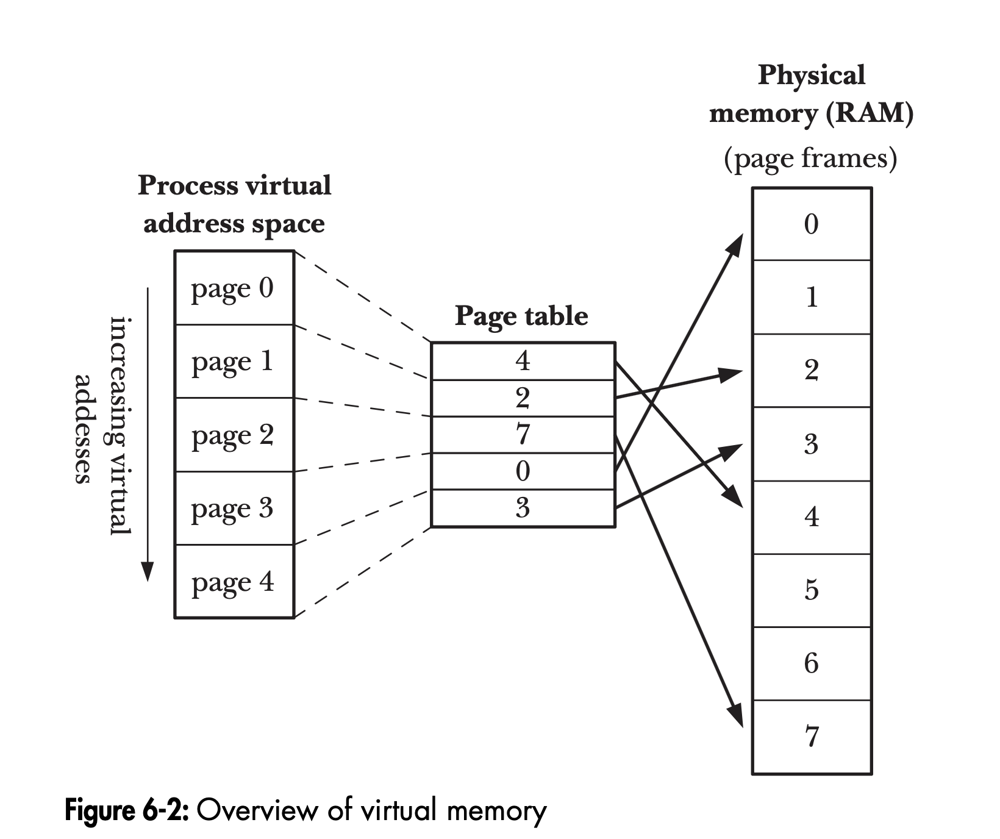

# I. Fundamental Conepts:

# II. File I/O. The Universal I/O Model

# III. File I/O Further details

# IV. PROCESSES

## Proceed ID Limits: 

Once it has reached 32,767, the process ID counter is reset to 300, rather than 1.
This is done because many low-numbered process IDs are in permanent use by
system processes and daemons, and thus time would be wasted searching for
an unused process ID in this range.
In Linux 2.4 and earlier, the process ID limit of 32,767 is defined by the
kernel constant PID_MAX. With Linux 2.6, things change. While the default
upper limit for process IDs remains 32,767, this limit is adjustable via the value
in the Linux-specific /proc/sys/kernel/pid_max file (which is one greater than
the maximum process ID). On 32-bit platforms, the maximum value for this
file is 32,768, but on 64-bit platforms, it can be adjusted to any value up to 222
(approximately 4 million), making it possible to accommodate very large num-
bers of processes.

## WHat is Process and Pgraom? 

A process is an instance of an executing program. In this section, we elaborate on
this definition and clarify the distinction between a program and a process.
A program is a file containing a range of information that describes how to con-
struct a process at run time

## What is Pages? 

A virtual memory scheme splits the memory used by each program into small,
fixed-size units called pages



## What us stack memory and stack frames? 

The stack grows and shrinks linearly as functions are called and return. For Linux
on the x86-32 architecture (and on most other Linux and UNIX implementations),
the stack resides at the high end of memory and grows downward (toward the
heap). A special-purpose register, the stack pointer, tracks the current top of the
stack. Each time a function is called, an additional frame is allocated on the stack,
and this frame is removed when the function returns.

## Location of the program variables in process memory segmemnts: 

```
#include <stdio.h>
#include <stdlib.h>
char globBuf[65536]; /* Uninitialized data segment */
int primes[] = { 2, 3, 5, 7 }; /* Initialized data segment */
static int
square(int x) {
/* Allocated in frame for square() */
int result; /* Allocated in frame for square() */
result = x * x;
return result; /* Return value passed via register */
}
static void
doCalc(int val) {
/* Allocated in frame for doCalc() */
printf("The square of %d is %d\n", val, square(val));
if (val < 1000) {
int t; /* Allocated in frame for doCalc() */
t = val * val * val;
printf("The cube of %d is %d\n", val, t);
}
}
int
main(int argc, char *argv[]) {
/* Allocated in frame for main() */
static int key = 9973; /* Initialized data segment */
static char mbuf[10240000]; /* Uninitialized data segment */
char *p; /* Allocated in frame for main() */
p = malloc(1024); /* Points to memory in heap segment */
doCalc(key);
exit(EXIT_SUCCESS);
```

## Summary: 

- Each process has a unique process ID and maintains a record of its parent’s process ID.
- The virtual memory of a process is logically divided into a number of segments:
text, (initialized and uninitialized) data, stack, and heap.
- The stack consists of a series of frames, with a new frame being added as a
function is invoked and removed when the function returns. Each frame contains
the local variables, function arguments, and call linkage information for a single
function invocation.
- The command-line arguments supplied when a program is invoked are made
available via the argc and argv arguments to main(). By convention, argv[0] contains
the name used to invoke the program.
- Each process receives a copy of its parent’s environment list, a set of name-value
pairs. The global variable environ and various library functions allow a process to
access and modify the variables in its environment list.
- The setjmp() and longjmp() functions provide a way to perform a nonlocal goto
from one function to another (unwinding the stack). In order to avoid problems
with compiler optimization, we may need to declare variables with the volatile
modifier when making use of these functions. Nonlocal gotos can render a pro-
gram difficult to read and maintain, and should be avoided whenever possible.

# V. Memory Allocation

## Differrence between the `brk()` and `sbrk()` ? 

- `brk()` - The brk() system call sets the program break to the location specified by end_data_segment. Since virtual memory is allocated in units of pages, end_data_segment is effectively rounded up to the next page boundary.
- Basically it increases the heap memory size based on the location specified. 

- `sbrk()` - A call to sbrk() adjusts the program break by adding increment to it. 

## Is sbrk() and brk() are system calls or simply glibC library functions? 

- This is a classic "gotcha" question in Linux internal interviews because the answer depends on whether you are talking about the **function** you call in C or the **instruction** the kernel executes.

The short answer is: **`brk()` is both, but `sbrk()` is only a glibc library function.**

---

### 1. The Breakdown

* **`brk()`:**
* **System Call:** The Linux kernel provides a `sys_brk` system call.
* **Library Wrapper:** `glibc` provides a wrapper function also named `brk()`. When you call `brk()` in C, you are calling the library function, which then executes the system call.


* **`sbrk()`:**
* **Library Function ONLY:** There is **no** `sbrk` system call in the Linux kernel.
* **How it works:** `glibc` implements `sbrk()` as a "helper" library function. Inside the `glibc` source code, `sbrk()` performs its logic by calling the `brk()` system call.


---

### 2. The "SRE-Level" Difference (Return Values)

One reason interviewers ask this is to see if you know that the **Library Wrapper** and the **Raw System Call** behave differently for `brk()`.

| Feature | `glibc` `brk()` Wrapper | Raw Linux `brk` System Call |
| --- | --- | --- |
| **Success Return** | Returns `0`. | Returns the **new** program break address. |
| **Failure Return** | Returns `-1` (and sets `errno`). | Returns the **old/current** program break address. |

**Why the difference?**
The Linux kernel's design is more "functional"—it always returns the current state. `glibc` wraps this to follow the standard POSIX C convention where `0` is success and `-1` is failure.

---

### 3. How `sbrk()` is implemented in `glibc`

Since the kernel doesn't have `sbrk`, `glibc` has to do the math for you. Here is the conceptual logic of what happens inside `libc.so`:

1. You call `sbrk(1024)` (request 1KB).
2. `glibc` first finds the **current** break by calling the system call `brk(0)`.
3. `glibc` calculates the **new** break: `current_break + 1024`.
4. `glibc` calls the system call `brk(new_break)`.
5. If successful, `glibc` returns the `old_break` pointer to your application.

---

### 4. Summary Table

| Function | Is it in `glibc`? | Is it a System Call? | Primary Role |
| --- | --- | --- | --- |
| **`brk`** | Yes | **Yes** | Sets the heap boundary to an **absolute** address. |
| **`sbrk`** | Yes | **No** | Moves the heap boundary by a **relative** increment. |

### How to prove it yourself

You can see this in action on any Linux machine using the `strace` tool. If you write a C program that calls `sbrk(1024)`, and then run it through `strace`, you will notice that the output shows a `brk(...)` system call, but you will never see a system call named `sbrk`.

Would you like me to provide a simple C snippet and the `strace` command so you can see this "translation" happening in real-time?

## About `malloc()` and `free()` ? 

- In general, C programs use the malloc family of functions to allocate and deallocate memory on the heap. These functions offer several advantages over brk() and sbrk(). In particular, they: are standardized as part of the C language;

- provide a simple interface that allows memory to be allocated in small units; and allow us to arbitrarily deallocate blocks of memory, which are maintained on a free list and recycled in future calls to allocate memory.

## Why `malloc()` and `free()` are better than the `brk()` and `sbrk()` ? 

It is a common point of confusion, but technically, **`malloc()`** and **`free()`** are not system calls—they are **library functions** provided by the C standard library (like `glibc` on Linux).

They act as a "middleman" between your application and the kernel. When your application needs memory, it asks `malloc()`. If `malloc()` has enough "spare" memory already, it gives it to you instantly. If it doesn't, it then triggers the actual system calls like `brk()` or `mmap()` to request more from the kernel.

---

### Why `malloc()` is "Better" than `brk()` / `sbrk()`

While `brk()` is the raw tool for moving the boundary of your heap, it is quite "dumb." Using `malloc()` is better for several reasons:

#### 1. Efficiency (Buffering)

System calls are expensive because the CPU must switch from "User Mode" to "Kernel Mode."

* **The Problem with `sbrk()`:** If you asked for 4 bytes via `sbrk()` every time you needed an integer, your program would spend all its time talking to the kernel.
* **The `malloc()` Solution:** `malloc()` uses a technique called **buffering**. When you ask for 4 bytes, `malloc()` might ask the kernel for 128KB via `brk()`. It gives you the 4 bytes you asked for and keeps the rest in a local "pool." Future requests for memory are satisfied from this pool without needing a slow system call.

#### 2. Byte-Level Granularity

The Linux kernel manages memory in **Pages** (usually 4KB).

* **The Problem with `brk()`:** The kernel can only increase your heap in increments of full pages. If you only need 10 bytes, calling `brk()` still forces the kernel to give you at least 4096 bytes.
* **The `malloc()` Solution:** `malloc()` manages that 4KB page for you, slicing it into tiny pieces so you can allocate exactly as much as you need without wasting memory.

#### 3. Recycling and "Free Lists"

This is where `free()` shines compared to simply trying to "shrink" the heap with `brk()`.

* **The Problem with `brk()`:** You can only shrink the heap from the **very top**. If you allocate A, B, and C, then free A and B, you cannot move the "program break" down because C is still at the top, blocking the way.
* **The `malloc()` Solution:** When you call `free()`, `malloc` doesn't necessarily give the memory back to the OS. Instead, it puts that chunk into a **Free List** (or "bins"). The next time you call `malloc()`, it checks this list first to see if it can reuse a "hole" in the middle of your heap.

#### 4. Handling Large Allocations (`mmap`)

Modern `malloc()` implementations (like the one in `glibc`) are smart.

* For small requests, they use `brk()`.
* For very large requests (typically > 128KB), they bypass the heap entirely and use the **`mmap()`** system call. This creates a separate "island" of memory that can be returned to the OS independently, preventing a single large allocation from "pinning" the heap and causing memory fragmentation.

---

### How `free()` knows how much to free

Since you only pass a pointer to `free(ptr)`, you might wonder how it knows the size of the block. `malloc()` hides "metadata" (usually 8 or 16 bytes) just **before** the pointer it returns to you. This hidden header contains the size of the block and other bookkeeping info.

| Metadata (Size, Flags) | The Memory You Use (ptr points here) |
| --- | --- |
| `[ 32 bytes ]` | `[ Your Data... ]` |

---

### Summary Table

| Feature | `brk` / `sbrk` | `malloc` / `free` |
| --- | --- | --- |
| **Type** | System Call | Library Function |
| **Management** | Manual/Global | Automated/Granular |
| **Speed** | Slow (Context Switches) | Fast (Uses local pool) |
| **Recycling** | None (Only end-of-heap) | Advanced (Reuses holes/bins) |

[How processes get more memory (mmap, brk)](https://www.youtube.com/watch?v=XV5sRaSVtXQ)
This video provides an excellent visual walkthrough of how the heap grows and how `malloc` coordinates with the kernel to manage your program's memory.

Would you like me to explain the different "bins" (fastbins, small bins, etc.) that `malloc` uses to stay fast in multi-threaded programs?

# VI. USER AND GROUPS

