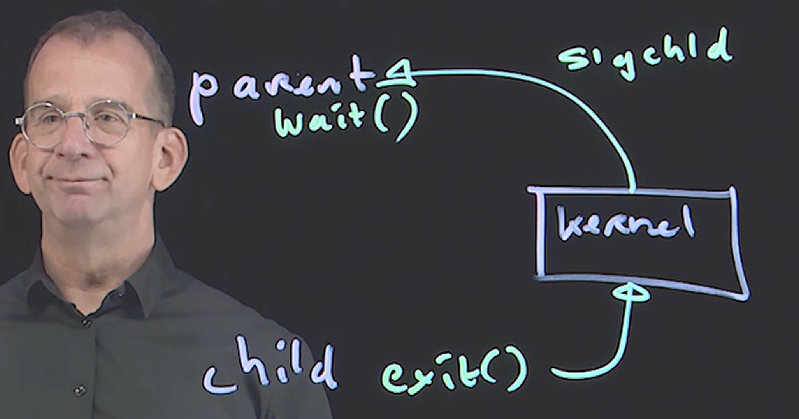
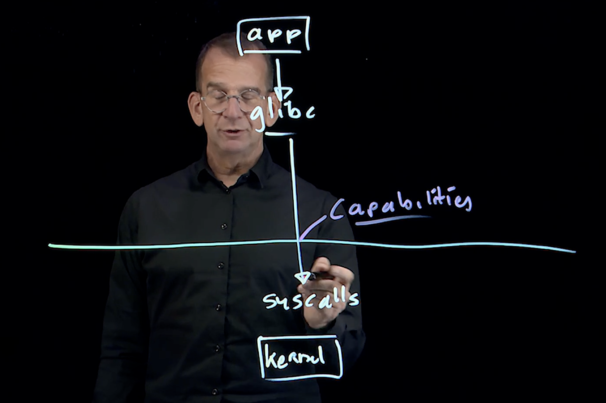
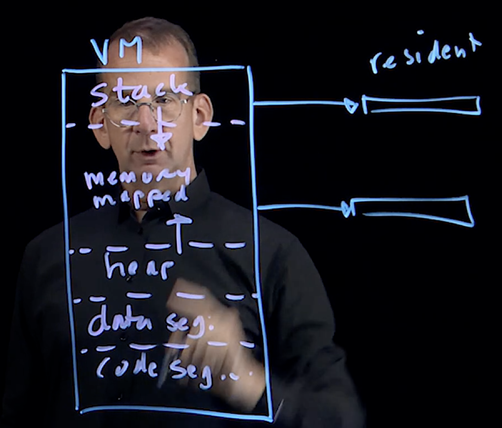
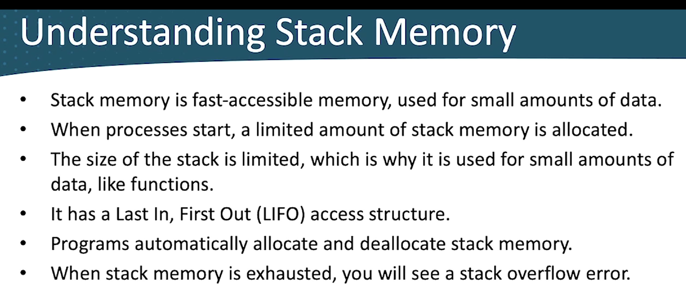
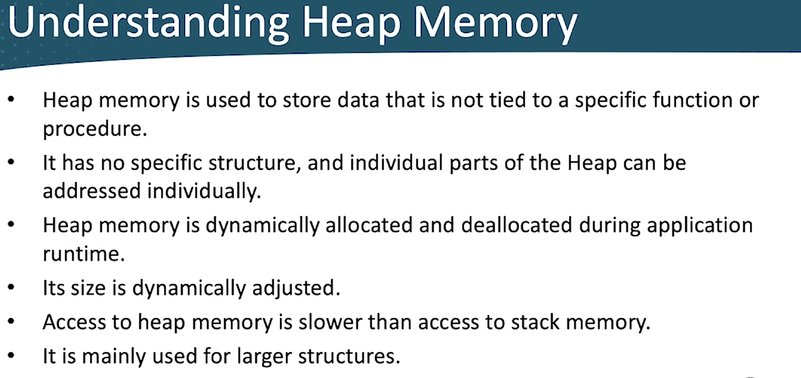
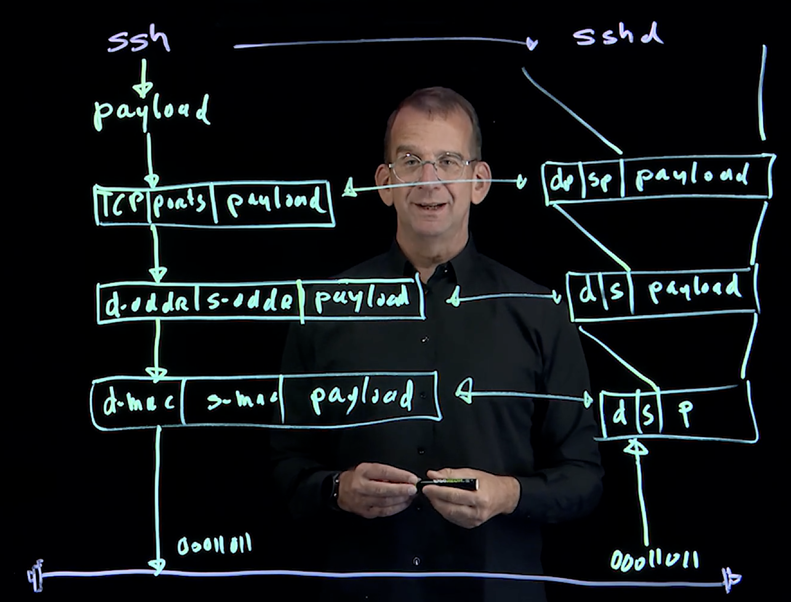
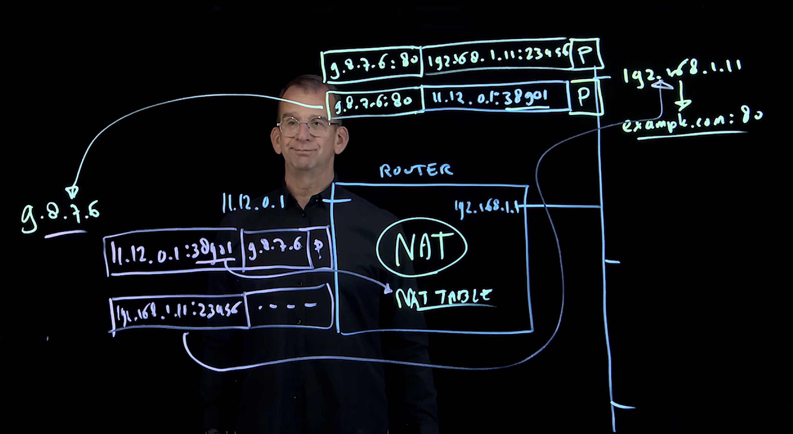
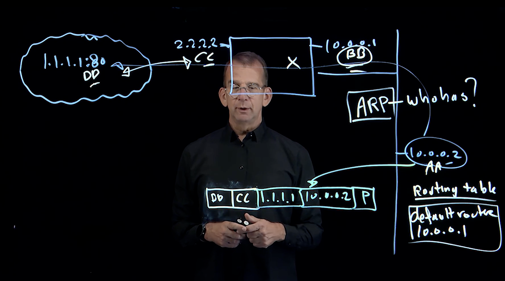

# Core Linux 

## memory management

## Linux Memory Allocation Virtual Vs Physical Memory:

- Virtual Memory: 
  - Total addressable memory that is provided by the CPU Architecture
  - Virtual Memory is sum of RAM and Swap
- Physical memory:
  - Sum of emulated RAM (swap) is referred to as "Physical Memory"

## What happens when a process loads in Linux ? 

- When the process loads it creates some virtual address space
- To that virtual address space virtuam memory offset will be assigned that are private to the process
- When the process requests physical memroy access, the kernel maps the physcial address of a memory page to the virtual address used by that process.
- We can find the details in `/proc/cpuinfo` or `/proc/meminfo`

## What is Cache? 

- Cache is tempory storage for faster data access
- Cache is used at different levels: 
  - Internet proxy cache: Speeds up fetching data from the internet 
  - Disk cache: Speeds up fetching data from disk
  - CPU L3 cache: Slower chache to buffer the data from CPU recently used
  - CPU L2 cache: Used to buffer data the CPU has recently used
- Linux optimization, disk cache is important
- When system requires more memory it will clear memory that are used in buffer/cache

## In cache area of memory? 

- Page cache is a generic cache that maps to any type of block storage on disk
- Dentries represent a directory structure
- Inodes represent the files

## What is write cache? 

- Write cache consists of modified files that are stored in cache to make disk writes more efficient. 
- The writes cache is referred to as buffer cache 
- This can be tuned using `sysctl diry cache`


## What is active/in-active memory? 
- Linux keeps track of active and inactive memory
- Active memory is memory that has been recently used, inactvie memory hasn't been used recently. 
- When a memory shortage occurs kernel considers inactive memory.
- This is an automatic process
- Degraded performance will occur if active file memory is dropped as well
- Manually can be dropped using sysctl vm.drop_caches
  - 1: Will drop page cache only
  - 2: drops dentries and inodes
  - 3: drops pages cache as well as dentried and inodes

- Below demo showed how can free in the inactive memory ? 

```
 504  cat /proc/meminfo 
  505  free -m
  506  echo $(( 748-154 ))
  507  echo 3 > /proc/sys/vm/drop_caches 
  508  echo $(( 748-154 ))
  509  free -m
  510  cat /proc/meminfo 
  511  free -m

```

### Inactive anonymous memory: 
- In active anonymous memory should not be stored in physical RAM 
- To deal with inactive anonympous memory, the Linux kernel can use swap.
- On memory shortage, inactive anonymous memory will be moved to swap first
- On serious memory shortage, active anonymous memory will be moved to swap as well.

## Why Linux Swap is important? 
- We have to use swap memory efficiently in order to move the anonymous memory to the swap memory from the physical! 
- Which put some less pressure on the RAM physical memory it will free up some memory space for the active memory. 
- This can be achievable using the kernel tuning parameter called `vm.swappiness=90` 
- 

## How much swap is needed? 
- There is no uniform answer to this question 
- On systems, with less than 1GB RAM, the recommendation is to allocate twice the amount of RAM as swap. 
- On systems with more than 4GB, having 25% of RAM available in swap is often enough
- SOme application having their own recommendation 
- Some applications dont work well if swap is enabled ex: Kubernetes
***Important** - Monitoring the swap mem usage is very Important. 
- First,compare the swap usage to the inactive memory. If more swap is used than the inactive memory, you migh have an issue.
```
[root@localhost ~]# free -m
               total        used        free      shared  buff/cache   available
Mem:            1699         960         209          21         635         738
Swap:           2047           0        2047
```
- Above the used memory is more than active and inactive anonymous memory - Because it includes the buffer/cache memory and also kernel memory

```
rocs -----------memory---------- ---swap-- -----io---- -system-- ------cpu-----
 r  b   swpd   free   buff  cache   si   so    bi    bo   in   cs us sy id wa st
 0  0 679936  84764     12 329904   27  151   310   386   92  240  1  1 98  0  0
[root@localhost ~]# vmstat 2 50
procs -----------memory---------- ---swap-- -----io---- -system-- ------cpu-----
 r  b   swpd   free   buff  cache   si   so    bi    bo   in   cs us sy id wa st
 1  0 679936  84764     12 329868   27  151   310   385   92  240  1  1 98  0  0
 0  0 679936  84764     12 329868   10    0    10     0  189  356  3  1 96  0  0
 0  0 679936  84764     12 329868    0    0     0     0  193  349  2  1 97  0  0
 0  0 679936  84764     12 329868    0    0     0     0  184  336  3  1 96  0  0
 0  0 679936  84764     12 329868    0    0     0     0  201  372  4  1 95  0  0
 0  4 679936  84284     12 330524  114    0   418     0  618 1263  8  1 90  0  0
 0  0 660992  50900     12 352040 14452    0 23762     0 2554 6596 27  4 66  3  0
 0  0 414720 471688     12 370844 18930    0 35492   263 3981 7889 17  6 68  9  0
 0  0 413184 588900     12 398120  896    0 16180   302 1003 1675 13  2 83  2  0
 0  0 413184 589908     12 398164    8    0    38     0  425  714  6  2 92  0  0
 0  0 413184 590916     12 398164    0    0     0     2  457  862  7  3 90  0  0
 3  0 407552 687188     12 413180 1902    0  9494     0  860 1592 13  5 81  1  0
 6  1 475392 233336    604 310228 2342 35484 76594 36321 4604 14428 57 21 18  3  0
 0  0 475392 129688    604 425280    2    0 56228   481 4004 12342 19  7 69  4  0
 0  0 475136 126664    604 427096   26    0  1306  1070 1080 3699 24  7 68  0  0

```

-  ## Definitions of si and bi
si (Swap In): This is the amount of memory (in KB/s) being moved from the Swap partition back into RAM.

Why it happens: A program needs data that the Linux kernel previously moved to the disk (swap) because RAM was full.

bi (Block In): This is the number of blocks (usually KB/s) being read from your disk (HDD/SSD) into the system's Memory Cache.

Why it happens: This occurs during normal file reading (e.g., copying a file, running a database query, or starting a program).

## What is huge pages:

- Default memory page have a size of 4096 bytes
- As a result, an application that needs 4GiB RAM, needs to administer 1,000,000 memory pages which causes a large overhead
- To allocate memory in more efficient way the huge page is used
- Huge page can have different size, but 2MiB is common

## What is dirty cache? 
- Before committing a write to a disk, it is kept in the buffer cache for a while
- this allows multiple writes to be collected, and thus make more efficient writes
- A longer time to collect files to be written will result in more efficient writes
- If, however the system fails while file wirtes have not been commited yet, the writes might get lost

## Out of Memory? (OOM)

- Memory overcommitting allows the sum of the all virutla memoru that is claimed by the applicagtion to be bigger than the total amount of physical memory. 

## What is slab? 
- Slabs are small segmentts of memory that are allocated by the Linux kernel

## Real world Scenario - Optimizing memory usage 

- Zswap - Compressed swap stored in RAM

# Processes:

## How a process is created? 

- When you run a command a new process is created as a child of current process
- To do so, the current process created exact copy of itself, a new unique process ID as assigned, and code the of the child process is loaded - to make this happen `fork()` system call is used. 
- Nex,`execve()` is used to replace the copied code with the new process code.
- In some cases fork() cannot be used.
- `execve()` can be used without forking the parent process. 
- `execve()` system call replaces the current process with the new process
- Because of that new process gets the PID of the old process, and no child-parent relationship created.

## Difference between the `fork()` and `execve()` system calls? 

- `fork()` - Will create a copy of the parent process and executes the code with a new PID
- `execve()` - Will not copy the process instead it will go and replace the parent process and gets the same ID. Due to to this there is no parent - child relationship created. This is done using the `exec` command.

```
[root@localhost]~# ps faux | grep -B 6 zsh
babu        2698  0.0  0.3 449980  6784 ?        Ssl  Dec22   0:00  \_ /usr/libexec/ibus-portal
babu        2768  0.0  1.2 595836 21284 ?        Ssl  Dec22   0:02  \_ /usr/libexec/xdg-desktop-portal-gtk
babu        2842  0.3  2.4 714864 42212 ?        Ssl  Dec22   4:50  \_ /usr/libexec/gnome-terminal-server
babu        2861  0.0  0.3 223980  5412 pts/0    Ss   Dec22   0:00  |   \_ bash
root        3042  0.0  0.4 238392  8044 pts/0    S    Dec22   0:00  |       \_ sudo -i
root        3046  0.0  0.3 223984  5388 pts/0    S    Dec22   0:00  |           \_ -bash
root       36284  0.0  0.2 223304  4056 pts/0    S    09:17   0:00  |               \_ zsh -----> Child Process done by `fork() system call
root       36305  0.0  0.3 223876  5356 pts/0    S    09:18   0:00  |                   \_ bash
root       36336  0.0  0.2 223300  4068 pts/0    S    09:18   0:00  |                       \_ zsh
root       36352  0.0  0.2 225740  3768 pts/0    R+   09:19   0:00  |                           \_ ps faux
root       36353  0.0  0.1 221376  2028 pts/0    S+   09:19   0:00  |                           \_ grep --color=auto -B 6 zsh

```

## Processes and Threads:

- ***Processes*** - A Process is an independent, self contained execution environment that has its own memory space. ex: VM
- ***Threads*** - Processes can create threads to run tasks that require concurrent execution. 
- Threads share the same memory space as the parent process.
- Threads are commonly used in web servers and database systems
- The Kernel scheduler is reponsible for managing threads and processes.
 
## When to use threads and when to use processes? 

- If applications require separate memory space for tasks, processes are better, as each process gets its own memory space
- If tasks need to share the data, threads are a better choice as they share the same memory space.

## Killing a Zombie? 

### How the process is killed in a normal situation? 
- Processes can voluntarily stop, using the exit() system call.
- Processes involutarily stop when they receive a signal.
- Signals can be sent by other users, other processes, or LInux itself. 
- When a process is stopped it issues the `exit()` system call. 
- Next, Linux kernel notifies this process to its parent by sending `SIGCHLD` signal. 
- The parent next executes the wait() system call to read the status of the child process as well as its exit code. 
- While using `wait()`, the parent also removes the entry of the child process from the process table. 
- Once that is done, process is removed.



### Zombie process?

- A zombie process is process that has completed its execution, but still has a PID in the process table
- A child process gets the status of Zombie when the communication between child and parent on child `exit()` is disturbed.

### ok, why this is happening? 

- This may happen if the parent doesn't execute the wait() system call
- It may also happen when the parent doesn't. receive the `SIGCHLD` signal from the child.

## What is Orphan process? 

- An orphan process is an active process whose parent process has finizhed. 
- Upon termination of the parent process, active child processes are normally adopted by the init process
- this ensures that the child process is getting properly reaped when it exits and doesn't become Zombie.

```
[root@localhost ~]# ps faux | grep -B 5 sleep
babu        2924  0.0  0.2 375656  4028 ?        Ssl  Dec22   0:00  \_ /usr/libexec/gvfsd-metadata
babu       37338  0.8  2.8 779292 50456 ?        Ssl  10:18   0:00  \_ /usr/libexec/gnome-terminal-server
babu       37356  0.0  0.3 223872  5292 pts/1    Ss   10:18   0:00      \_ bash
root       37384  0.0  0.4 238392  8036 pts/1    S    10:18   0:00          \_ sudo -i
root       37389  0.0  0.3 223852  5240 pts/1    S    10:18   0:00              \_ -bash
root       37428  0.0  0.0 220528  1740 pts/1    S    10:19   0:00                  \_ sleep 3600
root       37429  0.0  0.0 220528  1532 pts/1    S    10:19   0:00                  \_ sleep 7200
root       37432  0.0  0.2 225740  3684 pts/1    R+   10:20   0:00                  \_ ps faux
root       37433  0.0  0.1 221376  2120 pts/1    S+   10:20   0:00                  \_ grep --color=auto -B 5 sleep
[root@localhost ~]# kill -9 37389
Killed

[babu@localhost ~]$ ps faux | grep -B 5 sleep
babu        2768  0.0  0.5 595836  9468 ?        Ssl  Dec22   0:02  \_ /usr/libexec/xdg-desktop-portal-gtk
babu        2924  0.0  0.2 375656  4028 ?        Ssl  Dec22   0:00  \_ /usr/libexec/gvfsd-metadata
babu       37338  0.5  2.9 779548 50580 ?        Rsl  10:18   0:01  \_ /usr/libexec/gnome-terminal-server
babu       37356  0.0  0.3 223872  5292 pts/1    Ss   10:18   0:00  |   \_ bash
babu       37455  0.0  0.2 225740  3776 pts/1    R+   10:22   0:00  |       \_ ps faux
babu       37456  0.0  0.1 221376  2124 pts/1    S+   10:22   0:00  |       \_ grep --color=auto -B 5 sleep
root       37428  0.0  0.0 220528  1740 pts/1    S    10:19   0:00  \_ sleep 3600 --> It became the Orphan process and taken over by init
root       37429  0.0  0.0 220528  1532 pts/1    S    10:19   0:00  \_ sleep 7200


```

## How to clean the Zombie? 

- Zombies are little bit complicate to clean up because the Zombies are already dead. 
- Few workarounds: 
  - use `kill -s SIGCHLD <PPID>` - to send the SIGCHLD signal to the parent PID
  - Try to kill the parent PID, which will cause the Zombite process to be adopted by the init so that it can be reaped.
  - Reboot the system

- Below is the command to display the zombie process: 

```
root@localhost luth]# ps aux | grep defunc
root       38312  0.0  0.0      0     0 pts/1    Z    10:36   0:00 [zombie] <defunct>
root       38314  0.0  0.1 221376  2068 pts/1    S+   10:37   0:00 grep --color=auto defunc

```
- Below is the command to get the parent PID of a Zombie process.

```
[root@localhost luth]# ps -A ostat,pid,ppid | grep Z
Z      38312   38311
[root@localhost luth]# 
```

## Understanding the process scheduler: 

- Linux uses schedulers at a different levels
  - The process scheduler runs the process in realtime or normally
  - The I/O scheduler defines how I/O requests are handled

- Current Linux uses the complete Fair scheduler as the default scheduler

## Understanding the scheduler policies:

- `SCHED_OTHER` - The default Linux time-sharing scheduling policy which is used by the most process
- `SCHED_BATCH` - a non-realtime scheduling policy that is designed for CPU intensive tasks
- `SCHED_IDLE` - a policy which is intended for the low prioritized tasks
- `SCHED_FIFO` - A real time scheduler that uses the First in First Out algorithm
- `SCHED_RR` - Real time scheduler that used the round-robin scheduling

## `chrt` command

- `chrt -p <pid>` - To find the current scheduler policy a process is running
- Using chrt command line options to habdle the process by a different scheduler

## Understanding the Inter Process Communication

- IPC defined how the process can communicate using the shared data without the intervention of the operating system and kernel interface.
- A main goal of the IPC is reduce the fucntionality that is provided by the kernel.
## Approaches of IPC:

- Unamed pipes are used in the command line ex: `ls | less`
- Named pipes use file as a pipe and can be bi-directional
- Message-queue - Like pipes, but with re-ordering if data is received out of order. Can be used by applications like rsyslogd.
- SIgnals are also considered to be IPC, where OS sending some signals to Process
- RPC - Remote Procedure Calls - allow processes to call the other processes running in the same machine or in the remote machine.

## Remote Procedure Calls:

- RPC is used in distributed computing for executing the subroutines in a different address spaces. 
- RPC is developed for client-server communication Ex: NFS

# Lesson 11: Linux Commands and How do they work.

## What happens when a command is executed in Linux?

- Command need access to the specific system functions. i.e kernel space and user space 
- Command needs to create the execution environment
- It needs to load in memory
- it requests access to system resources like files
- it gets specific feature like system libraries
- it needs to load library functions


## Understanding the task Struct:
- From the process point of view, its the only thing running, and it has access to all memory and CPU. 
- `task_struct` - is the backbone of the Linux Kernel management system
- the `task_struct` includes the various fields that holds the process related information, this shows the different subdirs in /proc/PID
- When a scheduler switches the CPU from one process to another (context switching), it saves the current state of the CPU in its task_struct and loads the task_struct of the new process. 
- `/proc/PID` Is the best place to look what's currently going on with the `task_struct` internal kernel table.

## System space and User Space:

- User process typically need speicific functionality provided by the Linux Kernel 
- If a process runs on the Kernel space, it has unlimited access to all kernel features
- for a processes running in a user space, system calls are provided to expose speicifc parts of the kernel features
- To do this process needs a specific capabilities to access these syetem calls.

## Understanding System calls?

- System calls are defined in the kernel source code to allow the programs to access the functionality provided by the Linux Kernel. 
- They provide the controlled interface between the LInux Kernel space and the programs.
- When programs are executing the system call means they run the spcific parts of kernel code from the user space. 



## User `strace` command to analyze what's going with the system calls

- Notice that `strace` output is written to STDERR, not the STDOUT. 
- `strace ls | &less`
## How the processes gets access to the System call?

- In the earlier versions of Linux, processes would run as root or non-priviliges user. 
- This model was at risk of security threats
- to offer more fine grained access to the processes, later they introduced capabilities. 
- `setcap` used to set specific capabilities
- `getcap` used to get the capability currently set on the programs.

## How the process memory is organized? 

- When a process starts, it allocated a virtual memory. 
- Within the allocated virtual address space, the different areas will be used. 
- `code segment` - Where the program code is loaded, its size is equal to the size of a process file
- `data segment` - store the data and hard-coded variables defined by the programmer
- `heap memory` - segment is used for dynamic memory allocation in addition to data segment. where the variabled allocated and free during the process execution. 
- `Memory mapped regions` - are used for accessing the libraries and shared files. 
- `stack memory` - used to accesing the function calls.



## Stack memory: 



## heap memory:



## How the Linux commands exactly creating a new processes? 

- New processes are created by the parent process. 
- To do so, the parent process normally uses the `fork()` system call to create the child process. 
- after being created, the child process uses its `execve()` system call to create its own stack, heal and data. 
- Alternatively, a new process can be created using the bash internal `exec` instead of `fork()`
## Understanding the `fork()`:

- While creating a new process the parent process copies its execution environment to create the child process. 
- Using the `fork()` the child gets its own PID. 
- Initially, the child process components loaded in the memory is exactly same as the parent process components. 
- Later the child process `execve()` system call to replace the parent process's data and child's data will be loaded.

## Allocattion of Memory:

- `mmap()` - Used to create a new mapping in the virtual address space of the calling process.
- `brk()` - Changes the location of a program break. Which defined the end of the process data segment. Increasing it results in allocating more memory.

# Networking:

## Linux Network device names:

- MOdern Linux uses the BIOS device name as a network device names

## The OSI MOdel:

- Application layer - Ports are used and its present /etc/services
- Transport layer - Protocols are used and its present in /etc/protocols

- 

## Analyzing the packet headers:

- To analyze the packets the library called libpcap is used.

## IPV4 and IPV6 address:


## How Linux chooses Network interfaces? 

- 
- `traceroute -n 8.8.8.8` - Shows how many hops are there in between from one point to another.

## Analyze and optimize the networking

- network access layer is analyzied and monitored through `ethtool` and managed through `/proc/sys/net/core`

## Bonding and Teaming:

- Represents aggregated link that is backed by one or more network devices.
- Aggregated device will contain the IP configuration and distribute the load between the connected devices.