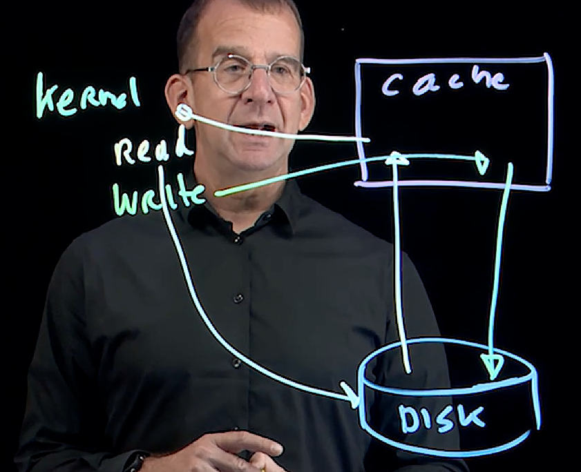
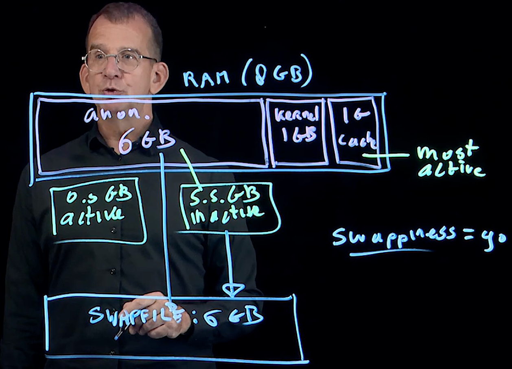

# Core Linux 

## memory management

## Linux Memory Allocation Virtual Vs Physical Memory:

- Virtual Memory: 
  - Total addressable memory that is provided by the CPU Architecture
  - Virtual Memory is sum of RAM and Swap
- Physical memory:
  - Sum of emulated RAM (swap) is referred to as "Physical Memory"

## What happens when a process loads in Linux ? 

- When the process loads it creates some virtual address space
- To that virtual address space virtuam memory offset will be assigned that are private to the process
- When the process requests physical memroy access, the kernel maps the physcial address of a memory page to the virtual address used by that process.
- We can find the details in `/proc/cpuinfo` or `/proc/meminfo`

## What is Cache? 

- Cache is tempory storage for faster data access
- Cache is used at different levels: 
  - Internet proxy cache: Speeds up fetching data from the internet 
  - Disk cache: Speeds up fetching data from disk
  - CPU L3 cache: Slower chache to buffer the data from CPU recently used
  - CPU L2 cache: Used to buffer data the CPU has recently used
- Linux optimization, disk cache is important
- When system requires more memory it will clear memory that are used in buffer/cache

## In cache area of memory? 

- Page cache is a generic cache that maps to any type of block storage on disk
- Dentries represent a directory structure
- Inodes represent the files

## What is write cache? 

- Write cache consists of modified files that are stored in cache to make disk writes more efficient. 
- The writes cache is referred to as buffer cache 
- This can be tuned using `sysctl diry cache`



## What is active/in-active memory? 
- Linux keeps track of active and inactive memory
- Active memory is memory that has been recently used, inactvie memory hasn't been used recently. 
- When a memory shortage occurs kernel considers inactive memory.
- This is an automatic process
- Degraded performance will occur if active file memory is dropped as well
- Manually can be dropped using sysctl vm.drop_caches
  - 1: Will drop page cache only
  - 2: drops dentries and inodes
  - 3: drops pages cache as well as dentried and inodes

- Below demo showed how can free in the inactive memory ? 

```
 504  cat /proc/meminfo 
  505  free -m
  506  echo $(( 748-154 ))
  507  echo 3 > /proc/sys/vm/drop_caches 
  508  echo $(( 748-154 ))
  509  free -m
  510  cat /proc/meminfo 
  511  free -m

```

### Inactive anonymous memory: 
- In active anonymous memory should not be stored in physical RAM 
- To deal with inactive anonympous memory, the Linux kernel can use swap.
- On memory shortage, inactive anonymous memory will be moved to swap first
- On serious memory shortage, active anonymous memory will be moved to swap as well.

## Why Linux Swap is important? 
- We have to use swap memory efficiently in order to move the anonymous memory to the swap memory from the physical! 
- Which put some less pressure on the RAM physical memory it will free up some memory space for the active memory. 
- This can be achievable using the kernel tuning parameter called `vm.swappiness=90` 
- 

## How much swap is needed? 
- There is no uniform answer to this question 
- On systems, with less than 1GB RAM, the recommendation is to allocate twice the amount of RAM as swap. 
- On systems with more than 4GB, having 25% of RAM available in swap is often enough
- SOme application having their own recommendation 
- Some applications dont work well if swap is enabled ex: Kubernetes
***Important** - Monitoring the swap mem usage is very Important. 
- First,compare the swap usage to the inactive memory. If more swap is used than the inactive memory, you migh have an issue.
```
[root@localhost ~]# free -m
               total        used        free      shared  buff/cache   available
Mem:            1699         960         209          21         635         738
Swap:           2047           0        2047
```
- Above the used memory is more than active and inactive anonymous memory - Because it includes the buffer/cache memory and also kernel memory

```
rocs -----------memory---------- ---swap-- -----io---- -system-- ------cpu-----
 r  b   swpd   free   buff  cache   si   so    bi    bo   in   cs us sy id wa st
 0  0 679936  84764     12 329904   27  151   310   386   92  240  1  1 98  0  0
[root@localhost ~]# vmstat 2 50
procs -----------memory---------- ---swap-- -----io---- -system-- ------cpu-----
 r  b   swpd   free   buff  cache   si   so    bi    bo   in   cs us sy id wa st
 1  0 679936  84764     12 329868   27  151   310   385   92  240  1  1 98  0  0
 0  0 679936  84764     12 329868   10    0    10     0  189  356  3  1 96  0  0
 0  0 679936  84764     12 329868    0    0     0     0  193  349  2  1 97  0  0
 0  0 679936  84764     12 329868    0    0     0     0  184  336  3  1 96  0  0
 0  0 679936  84764     12 329868    0    0     0     0  201  372  4  1 95  0  0
 0  4 679936  84284     12 330524  114    0   418     0  618 1263  8  1 90  0  0
 0  0 660992  50900     12 352040 14452    0 23762     0 2554 6596 27  4 66  3  0
 0  0 414720 471688     12 370844 18930    0 35492   263 3981 7889 17  6 68  9  0
 0  0 413184 588900     12 398120  896    0 16180   302 1003 1675 13  2 83  2  0
 0  0 413184 589908     12 398164    8    0    38     0  425  714  6  2 92  0  0
 0  0 413184 590916     12 398164    0    0     0     2  457  862  7  3 90  0  0
 3  0 407552 687188     12 413180 1902    0  9494     0  860 1592 13  5 81  1  0
 6  1 475392 233336    604 310228 2342 35484 76594 36321 4604 14428 57 21 18  3  0
 0  0 475392 129688    604 425280    2    0 56228   481 4004 12342 19  7 69  4  0
 0  0 475136 126664    604 427096   26    0  1306  1070 1080 3699 24  7 68  0  0

```

-  ## Definitions of si and bi
si (Swap In): This is the amount of memory (in KB/s) being moved from the Swap partition back into RAM.

Why it happens: A program needs data that the Linux kernel previously moved to the disk (swap) because RAM was full.

bi (Block In): This is the number of blocks (usually KB/s) being read from your disk (HDD/SSD) into the system's Memory Cache.

Why it happens: This occurs during normal file reading (e.g., copying a file, running a database query, or starting a program).

## What is huge pages:

- Default memory page have a size of 4096 bytes
- As a result, an application that needs 4GiB RAM, needs to administer 1,000,000 memory pages which causes a large overhead
- To allocate memory in more efficient way the huge page is used
- Huge page can have different size, but 2MiB is common

## What is dirty cache? 
- Before committing a write to a disk, it is kept in the buffer cache for a while
- this allows multiple writes to be collected, and thus make more efficient writes
- A longer time to collect files to be written will result in more efficient writes
- If, however the system fails while file wirtes have not been commited yet, the writes might get lost

## Out of Memory? (OOM)

- Memory overcommitting allows the sum of the all virutla memoru that is claimed by the applicagtion to be bigger than the total amount of physical memory. 

## What is slab? 
- Slabs are small segmentts of memory that are allocated by the Linux kernel

## Real world Scenario - Optimizing memory usage 

- Zswap - Compressed swap stored in RAM
