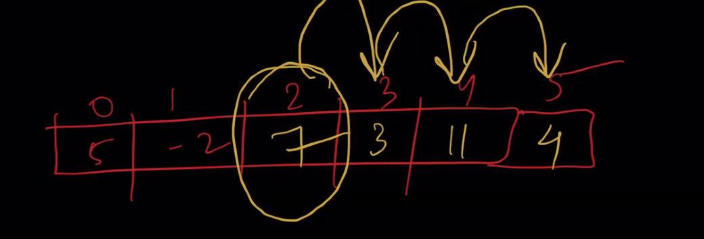
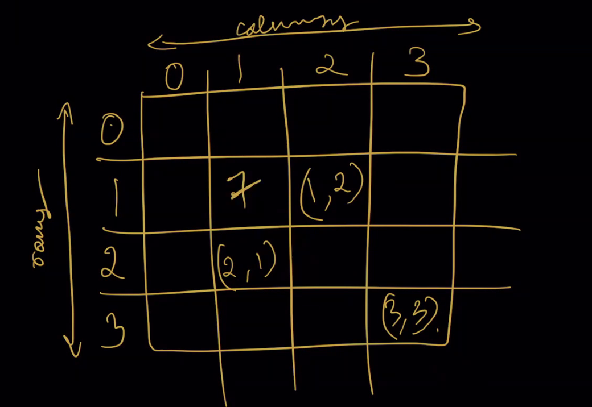
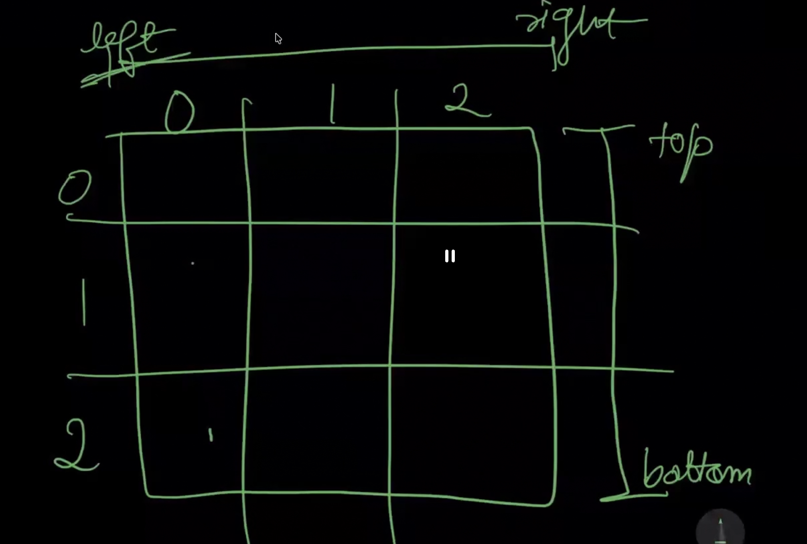
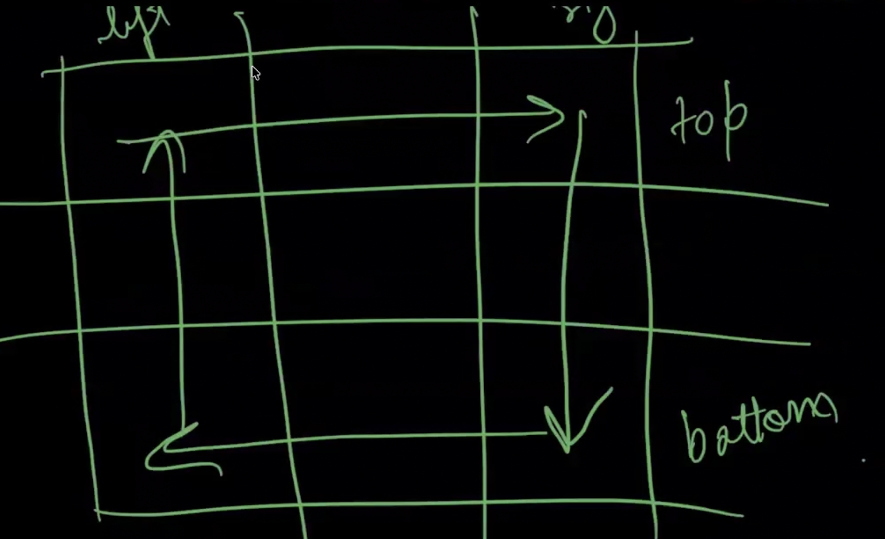

# Array and Maths

- Integer takes 4bytes of inyernal memory to store
- If we are directly accesing the element's index its called O(1) --> Order of 1 

- 11:42 AM 

- When we are try to insert a value to specific index the remaining values will be shifted to one index. So the time complexity O(N).

## 2D Array:



- 12:00 PM ## Spiral Matrix problem solving from leetcode

# Spiral Matrix: How to Solve Steps? 



## Initialization: 

- left = 0 ***colw***
- right = n-1 ***Col***
- top = 0 ***row***
- bottom - n-1 ***row***

## To fill the cells initialze a variable called 'count'

- count = 1

## Create a `while` loop

- `while(left <= right and top <= bottom)` ---> This is how we have to form the while loop

- In this while loop `top` will be tracking row number.
- In this while loop `right` will be tracking column number. 

## Next : How to form the traversal.



- first row ---> Traverse left to right 
- last column ---> Traverse top to bottom
- last row ----> Traverse right to left
- First column ----> bottom to top

## Coding

```
left = 0
right = n-1
top = 0
bottom = n-1
ans = []
count = 1

while(left <= right and top <= bottom):

    #First row
    for i in range(left,right):
        ans[top][i] = count
        count += 1
    top += 1

    #Last Column
    for i in range(top,bottom):
        ans[i][right] = count
        count += 1
    
    right -= 1
    
    #last row
    for i in range(right, left, -1):
        ans[bottom][i] = count
        count += 1
    
    bottom -= 1

    #first column
    for i in range(bottom, top, -1):
         ans[i][left] = count 
         count += 1
    
    left += 1

return ans

```
