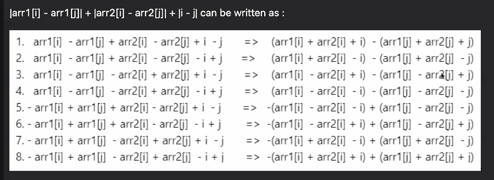

# Time and Space complexity

## Asymptotic notation: 

- O(Complexity) -- this is how we need to define the complexity

- Only thing which is taking time is Loops!
  - We need to consider how many loops are there in order to calculate the time.
  - O(n) - Size of the array
  - Neglect the constant values while degining the O(n-1) -> O(N), O(2N) -> (N). 

- Nested forloops time complexity.
  - TC is O(N^2) - When we have two nested for loops

- If everything is constant then the TC is O(1).

- If the loops are in a series then we have to add.

## Space complexity:
- to calculate the space complexity we just need to keep in mind like how many arrays we have used in our program.
- 

