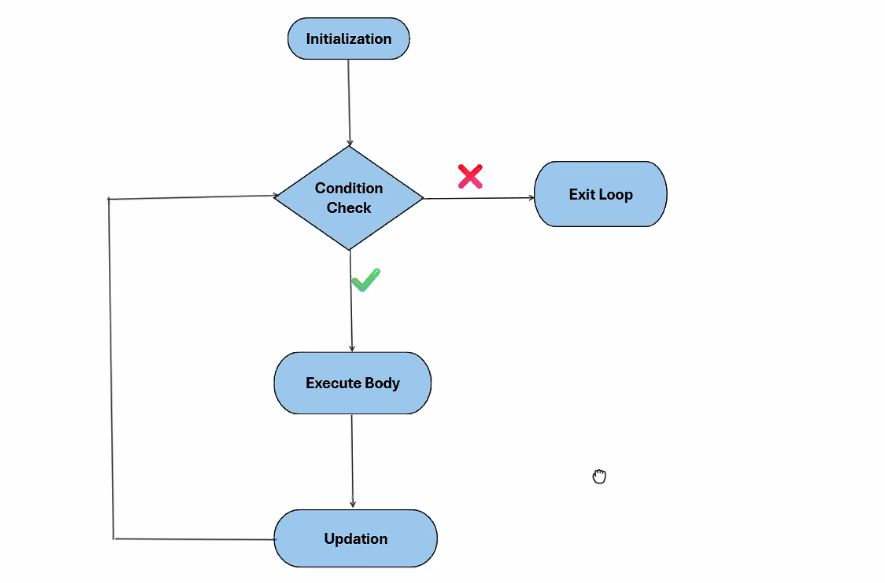

# Loops:
```
for (initilization, condition check, increment):
   //body of loop

for i in range(10):
  print("Hello world")

```
## Important concepts of for Loop:

- Initialization happends only once - at that start of loop. 
- Condition check happends before the start of each iteration
- Updation happens at the end of the each iteration



## While loop

```
// optional initialization
while(condition check){
    // body of the loop
    // optional updation
}
```

## Note: For and while loops are interchangeable

- There is no difference in terms of performance if we compare both the loops
- We can use any loops bases on our requirement! 

# Continue and Break! 

- As soon as we encounter the `continue` it will be treated as a last statement of current iteration. So the Loop continues!

# Updation operators: (Not available in Python) 
