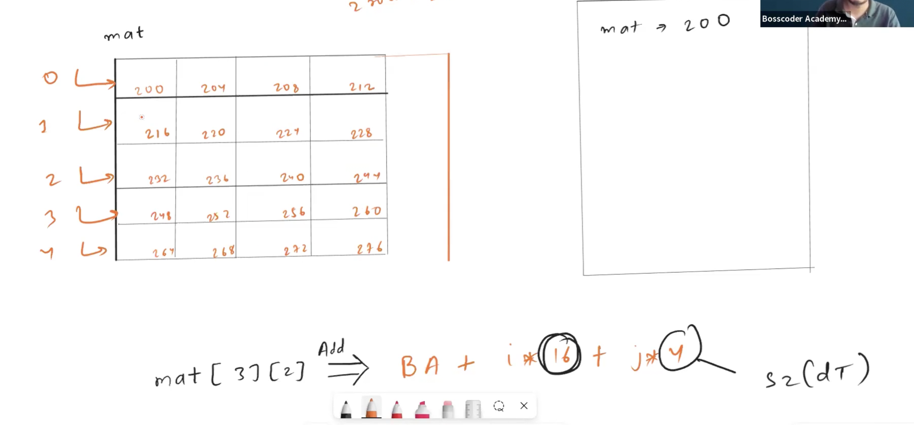
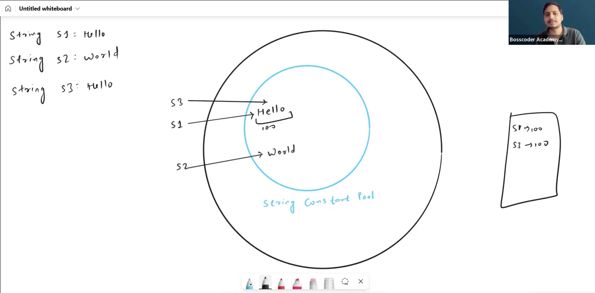
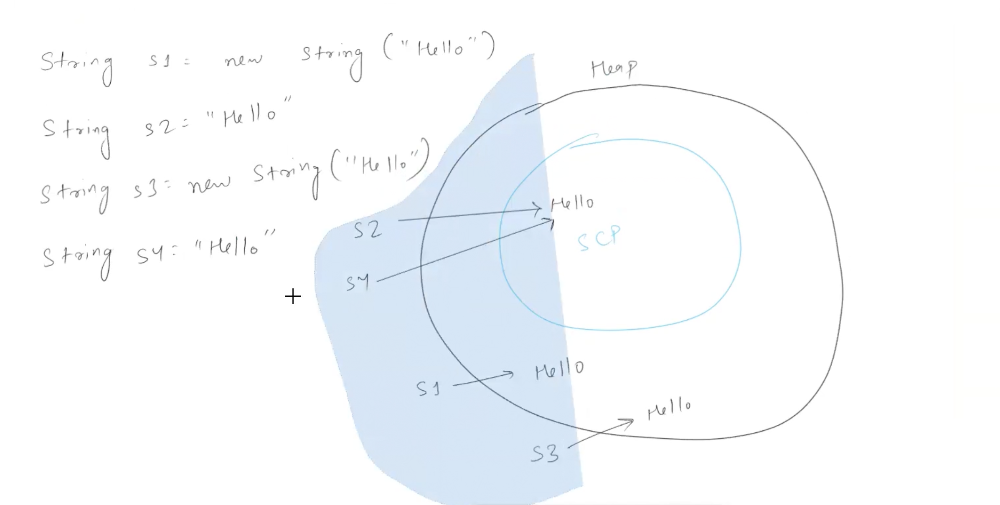

# 1D Array address allocation:

mat[i][j] = bases address + i*numof columns*sizeofdatatype + j*sizeofdatatype

```
mat = []
dcx
```

## Stirng:

- Due to memory optimization a string will be created and it will be referred by many variables

- ## 12:13 (Video) - Explained about the 2D array

## How the compiler gets the address for 1D array? 

- Since array is store in the contigious memory location so the formula here is `element_address = Base Address + index*SizeOfDataType` i.e (int the size is 4bytes)

- Example: 

```
arr = [1,2,3,4,5]

#Let's say the array starts with 0 index address is 200. 
#1 -> 200
#2 -> 204
#3 -> 208
#4 -> 212
#5 -> 216

# Now the compiler applies this formular when we try to retrieve the element in the specif index 

#Lets say we want arr[2] = 200 + 2 * 4 ==> 208 that is 3
```

## How the compiler gets the address for 2D array? 

In the same way formula here is `element_address = Base Address + (i * numberofColumns * SizeOfDataType) + (j * SizeOfDataType)`



- ## After this explained about the Sum of Matrix Diagonal

- ## (2:43 Video) Why string immutable in some languages? 

- Answer: For the Memory Optimization. Thats why string is immutable.One literal is linked with multiple references. Modifying one literal will affect all the references for the security and safety strings are immutable.


- In C++ string mutable, which means it can be modified. There is no concept pf string constant pool.
- String constant pool is used mainly in Java, Python.  

- All the string will be store inside the SCP (String constant Pool) - Memory will be allocated
- String constant Pool is inside the Heap memory is part of it. 
- In Java if you create outside the SCP it has one-to-one mapping.Which means inside the heap memory.

***Important in JAVA*** `==` compares the address not the value





